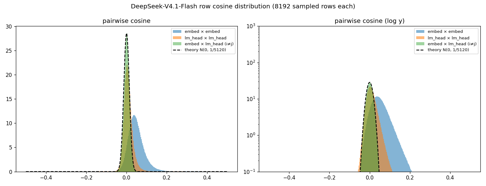

# 词嵌入 / LM Head 的两两余弦分布:高维近正交假设的实测

> 脚本:`analysis/ds_v4_1_flash/analyze_cosine_dist.py`;
> 数据:`output/ds_v4_1_flash/weight_moments/cosine_dist.{json,npz}`。
> 互补分析(同 token 的嵌入行 vs LM Head 行)见 `analyze_embed_lmhead.py`
> 与 [weight-moments.md](weight-moments.md) 结果 4。K3 同主题见
> [../kimi_k3/cosine-distribution.md](../kimi_k3/cosine-distribution.md)。

## 问题

"高维随机向量近乎垂直"常被引为注意力加权求和、残差累加不丢失信息的直觉基础。
理论:$d$ 维球面上两个均匀随机单位向量的余弦近似 $N(0, 1/d)$(精确密度正比于
$(1-c^2)^{(d-3)/2}$)。本模型的 $d=5120$,理论 std $\approx 0.0140$。
本文实测:训练后的 token 向量还在多大程度上符合这条理论曲线。

## 方法

全表 129280 行的 Gram 需 $2V^2d \approx 1.7\times10^{17}$ FLOP 与 64 GB 内存,不可行;
改为每表固定种子随机抽 8192 行(约 3355 万对),顺序扫盘两遍(共 5.3 GiB)+ 两次
约 0.7 TFLOP 的 GEMM,总耗时约 1 分钟。三种配对:表内 embed×embed、lm_head×lm_head,
以及跨表异 token 的 embed×lm_head( $i \ne j$,排除同 token 配对信号)。

## 结果

| 配对 | mean | std | std / 理论 | $\lvert\cos\rvert>0.1$ 占比 | 极值 |
| --- | --- | --- | --- | --- | --- |
| embed × embed | +0.049 | 0.0407 | **2.91x** | 9.59% | [-0.12, 0.90] |
| lm_head × lm_head | +0.009 | 0.0254 | 1.82x | 0.65% | [-0.40, 0.96] |
| embed × lm_head(异 token) | +0.001 | 0.0139 | **1.00x** | 0.00% | [-0.08, 0.10] |

## 解读

1. **跨表配对再次完美符合随机理论**(std 1.00x):与 K3(1.01x)一样,embed 与 lm_head
   各自训练、不共享,异 token 之间没有任何残余相关性。"无结构"极限下的理论曲线
   在第二个模型上再次验证。
2. **表内分布比理论宽(1.8~2.9x)且整体正偏**,但各向异性的载体与 K3 相反:
   K3 是 lm_head 更各向异性(2.89x vs 2.38x),本模型是 **embed 更各向异性**
   (2.91x vs 1.82x,mean 余弦 +0.049 vs +0.009)。与配对分析中 embed 侧
   cos_to_mean 中位 0.22 的强公共方向一致——本模型的"词频先验"式共享结构
   更多压在嵌入侧。
3. **embed 的右尾很重**:9.6% 的配对 $|\cos|>0.1$,最大 0.90——嵌入空间里存在
   成簇的近邻 token(语义/子词簇);lm_head 侧则出现了 -0.40 的强负配对
   (K3 最负只有 -0.43,同样存在),输出方向上确实有"互斥"结构。
4. **对"加和后信息保留"的修正版结论**:5120 维下无关向量的典型干扰仍是小量
   ( $|\cos| \sim 0.04$ ),$k$ 个向量相加的串扰约 $0.04\sqrt{k}$,$k \lesssim 100$
   时仍低于自项信号 1——近正交直觉成立;但 embed 侧 2.9x 的展宽 + 近 10% 的重尾
   意味着"把 token 向量当独立随机向量"对嵌入侧的容量高估比 K3 更严重,
   而 lm_head 侧反而更接近随机。
