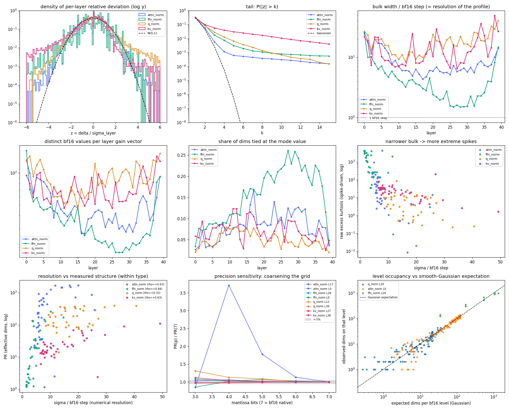
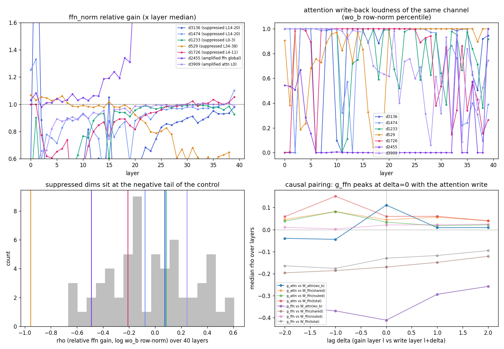

# RMSNorm 增益向量分析:尺度信息的真实载体

> 数据来源:`analysis/ds_v4_1_flash/analyze_norm_gains.py`(分布/集中度)与
> `analyze_norm_distribution.py`(分布形状),原始产物
> `output/ds_v4_1_flash/weight_moments/norm_gains.{npz,json}` 与 `norm_distribution.json`。
> 前序:[weight-moments.md](weight-moments.md)(权重矩分析);
> K3 同主题(含机制论证)见 [../kimi_k3/norm-gains.md](../kimi_k3/norm-gains.md)。

> **核心结论(与 K3 同向、更极端)**:
> RMSNorm 增益初始化时每个分量都为 1(参考推理代码 `RMSNorm` 为 ones 初始化);
> 训练完成后**子层入口增益普遍塌到 0.02–0.6**——attn_norm 只剩 0.02–0.05
> (与相邻投影实测的元素尺度 0.015–0.026 同量级),最终 norm 也只有 0.271;
> 唯一留在 1 附近的是注意力内部的 q_norm(0.83–1.42)。
> **"norm 增益 ≈ 1"在本模型同样不成立。**
>
> 两个后续修正(2026-09-19):
> (a) attn_norm 的**绝对大小是规范自由度**(下游 `q_norm`/`kv_norm` 把整体缩放抵消掉),
> 不携带功能信息,能塌到 0.02 并不奇怪——信息全在逐通道图案里;
> (b) 图案**不是"平得没有突出维"**:ffn_norm(PR 14/5120)与 kv_norm(PR 21/512)是
> 低维强集中,常驻通道为 **d2455**(ffn 一边倒放大)与 **RoPE 区 d448–511**(kv 系统
> 压低 12%);attn_norm 则是摊在 ~270 维上的弱结构。**原始余弦 ≈1 是假象,画像一律用
> 去均值口径看。**
> (c) 单层主体只有 3.6–16.7 个 bf16 量化级、分布是"高斯主体 + 稀疏尖峰"(§2.3),但 §2.4 的
> 三道检验表明量化粒度**不会掩盖结构**(截粗只会让 PR 偏高)。

## 背景

增益 $g$ 是 RMSNorm 归一化后的逐维缩放向量,可折入相邻投影( $W\,\mathrm{diag}(g)$ ),
是 pre-norm 架构里尺度信息的主要载体。机制与 K3 相同:增益与后续投影存在重参数化
冗余,weight decay 把两者压向平衡范数(Rotational Equilibrium,Kosson et al.,
NeurIPS 2023)——本模型 attn_norm 的均值(0.020–0.049)与相邻投影**实测**的元素尺度
同量级(wq_a 0.020–0.024、wkv 0.024–0.026、共享专家 w1 0.015–0.020),是"尺度在
增益与权重之间被双边分配"的一个干净例证。但这只是量级吻合,不单独构成机制判决:
权重侧本来就基本停在初始化尺度(weight-moments 结果 2),要区分"平衡到同一量级"
与"权重没动、只有增益被 decay 压小",还需要 weight decay 系数的信息。

**数值正确性(2026-09-19 复核,不是读取 bug)**:

1. 增益为 bf16 直接读取(`llm_lens` 自研解码),与 `safetensors` 官方库读同一分片
   **逐值 bit-exact 一致**——2026-09-19 把索引里**全部 248 个 norm `*.weight`** 逐一比对,
   **0 处不一致**,且这些张量没有 bias 等其它后缀参数(norm 确实只有增益这一个参数);
2. 官方推理代码 `inference/model.py` 的 `RMSNorm.forward` 是
   `(self.weight * x).to(dtype)`,**直接相乘**、`torch.ones` 初始化——不是 Gemma 式
   零初始化 + $(1+w)$ 参数化;官方 `convert.py` 对 norm 类权重只改名、不做任何数值
   变换。所以文件里存的 0.02 就是推理时生效的乘性增益,"少加了一个 1"的假设不成立;
3. 旁证:嵌入/LM Head 长到 6–8 倍(weight-moments 结果 1)与入口增益塌到 1/40 并存,
   说明尺度被整体"搬家";视觉塔(同 checkpoint 独立 ViT)的 norm 同样塌到 0.05–0.43,
   排除单模块转换 bug。
4. 两条"非均匀"证据(2026-09-19 补,`tmp/verify_norm_init.py`):跨类型衰减幅度从
   **1.2×(q_norm 0.825–1.415)到 50×(attn_norm 0.020–0.049)差约 40 倍**——若是某个统一缩放/
   转换 bug,所有增益应当同比例缩放,**排除**;且 **248 个增益里没有一个恒等于 1.0**,
   也没有漏训的 norm;attn_norm 全张量(5120×40 = 20.5 万分量)里最大的一个也只有 **0.348**,
   即连个别通道都没留在初始量级。

"初始化是 1 所以训练后应留在 1 附近"的直觉不成立的原因:$g$ 与相邻投影 $W$ 存在
尺度冗余( $g\mapsto cg$、 $W\mapsto W/c$ 功能不变),哪个尺度落在 $g$ 上完全由优化器
+ weight decay 决定,与初始化值无关。

## 结果


### 1. 四类主干增益的深度画像

| 增益类型 | mean 范围(浅层→深层) | 说明 |
| --- | --- | --- |
| `attn_norm`(注意力入口) | 0.020 → 0.049 | **塌到权重尺度**,衰减 20–50 倍 |
| `ffn_norm`(FFN 入口) | 0.126 → **0.613** | 衰减但**随深度回升**,最深 4 层 >0.47 |
| `attn.q_norm`(Q 低秩后) | 0.83–1.42 | **留在 1 附近**,最接近常规认知 |
| `attn.kv_norm`(KV latent 后) | 0.25–0.78 | 中度衰减 |
| 最终 `norm`(lm_head 前) | **0.271**(std 0.023) | 不在 1 附近( K3 为 0.796 ) |

衰减排序与 K3 一致("对 loss 越间接压得越狠"),但有两点不同:

- **ffn_norm 随深度单调上行**(0.126→0.613),而 K3 的对应增益浅深都在 0.01–0.38 低位。
  配合 Hyper-Connections(残差流是 4 份副本经 Sinkhorn 混合),深层 FFN 的"入口力度"
  被显著调大,尺度设计与单流残差架构不同;
- **q_norm 留在 1 附近**:q_norm 的输出直接进 wq_b 产生注意力 logit,对 loss 极直接;
  kv_norm(0.25–0.78)衰减多于 q_norm——K 侧打分还受 softmax 温度/attn_sink 缓冲。

负增益几乎不存在(四类主干增益 ≤0.2%,attn_norm/ffn_norm 为 0)——通道符号稳定,
与 K3 的 layernorm 一致(但 K3 的 AttnRes res_norm 有 30–45% 负值,本模型没有对应模块)。

**为什么 attn_norm 能塌到 0.02 而不付 loss 代价:它是规范自由度(gauge)**。它的输出只流向
`wq_a` 与 `wkv`,而这两者后面紧接着又各有一个 RMSNorm(`q_norm`/`kv_norm`,且 RMSNorm 对
输入的**整体尺度不变**)。所以把 attn_norm 的增益整体乘 $c$ 再让下游除回来是**恒等变换**
(只受 eps=1e-20 限制,在 0.02 处毫无作用):**它的绝对大小不携带功能信息,只有逐通道
图案 δ(CV 中位 0.027)有信息**。这正是 weight decay 能把它一路拖到权重尺度的原因——这一维
上没有梯度信号。对照 `ffn_norm`:下游是 SwiGLU 非线性(+`swiglu_limit=10` 的 clamp),尺度
不自由,所以只衰减到 0.126–0.61 且随深度回升。**"衰减按对 loss 的直接性排序"由此从现象
描述升级为机制**:自由度大的塌得狠,自由度小的被 loss 拉住。

**旁证(官方报告的优化器分配)**:全部 RMSNorm 及非矩阵参数共用同一套优化器 **AdamW(wd=0.1)**,
而 attn_norm(0.02)与 q_norm(1.0)在同一套超参下差 50 倍——可见差异不可能来自"优化器待遇不同",
只能来自损失对各自**尺度**的敏感度(即上面的 gauge 论证)。

### 2. 通道画像:先修口径,再看集中度

#### 2.1 口径修正:原始余弦是假象(2026-09-19)

- **原始余弦几乎没有判别力**:四类主干增益的 CV 中位只有 0.024–0.095,是近乎"平"的
  正向量;两条**互相独立**、同 CV 的正向量原始余弦基线就有 $\approx 1/(1+\mathrm{CV}^2)$
  ≈0.999。实测原始余弦 attn_norm 0.9994、ffn_norm 0.9999、q_norm 0.9936、
  kv_norm 0.9946 —— 这个量级基本由共同均值(DC)撑起,不能作为"画像稳定"的证据;
- **去均值(皮尔逊)余弦才是画像口径**,实测中位:ffn_norm **0.837**(最低 0.012)、
  kv_norm 0.320(最低 −0.095)、attn_norm **0.294**(最低 −0.115)、q_norm −0.009;
- **同层 attn_norm 与 ffn_norm 去均值余弦中位仅 0.162(最低 −0.513)**:两分支入口的
  通道画像**整体上不相关**——此前"几乎重合(0.999)"的结论来自原始余弦,作废;
  (但两分支确实**共用少数常驻通道**,见 2.2,共同部分只占方差的小头);
- 真正跨层稳定的是 **ffn_norm**(0.837):FFN 入口的通道画像确实逐层继承;
  attn_norm 的画像随层漂移(0.294,个别相邻层近正交甚至反向)。

#### 2.2 集中度:是"少数维/一整块",不是"没有突出维"(2026-09-19 新增)

对每层 z-score 画像(去均值只看形状)算**有效维数** PR $=(\sum p^2)^2/\sum p^4$
与 top-10 维的方差占比;白噪声基线分别是 $d/3$ 与 $10/d$,所以 PR 越小越集中。

| 类型 | d | PR 中位(白噪声基线) | top-10 占中心化方差(基线) | 跨层 PC1(独立基线 0.025) | 偏度 | 形态 |
| --- | --- | --- | --- | --- | --- | --- |
| `attn_norm` | 5120 | 267(1707) | 9.6%(0.20%) | 0.153 | −0.37 | 无单点主导,结构摊在 ~270 维上 |
| `ffn_norm` | 5120 | **14**(1707) | **40%**(0.20%) | **0.417** | +0.37 | 极低维强集中 + 跨层共同 |
| `kv_norm` | 512 | **21**(171) | **60%**(1.95%) | **0.332** | −3.51 | 一整块(见下),少数维被压制 |
| `q_norm` | 1280 | 180(427) | 16%(0.78%) | 0.034 | +0.46 | 中等集中,无跨层共同画像 |

PR=14(d=5120)意味着"只有十来个维在说话",是**压倒性集中**而不是平坦;这些偏差也不是
bf16 量化噪声(量化相对步长 ~0.1%,远小于 CV 的 2.4–9.5%)。**常驻突出维**(在 ≥3 层
挤进 top-10 $|z|$ 的维,括号为层数):

| 类型 | 常驻突出维 |
| --- | --- |
| `attn_norm` | d3136(35) d1474(18) d2455(15) d529(15) d1726(13) d2953(11) d1233(9) d3909(4) |
| `ffn_norm` | d3136(32) d1474(28) d2455(26) d1726(24) d529(20) d3447(16) d1233(15) d2953(15) |
| `kv_norm` | d448(27) d450(19) d469(19) d471(19) d451(18) d466(18) d449/452(17) |
| `q_norm` | d1161/d1169/d1103(各 3,几乎无常驻维) |

三条结构:

1. **attn_norm 与 ffn_norm 共用同一批突出通道,且符号一致**:d3136 在两处都是 38/40 层
   被压制(mean $z$ −12.1 / −14.5),d1233 在 ffn_norm 39/40 层被压制(−5.9),
   d1474/d529/d1726 同样偏负;d2455 则被 ffn_norm 一边倒放大(+30.3,39/40 层为正,
   L36 达同层中位 4.8 倍, g=2.64)。"哪些通道要被调"有相当一部分是**残差流的全局属性**,
   两个分支继承同一份清单(与 2.1 的整体低相关不矛盾:共同部分只占方差的小头,
   大部分逐层偏差仍是各自特异的);
2. **kv_norm 的突出块正好落在 RoPE 维**:常驻维 d448–d471 全部属于 head_dim=512 的末 64 维
   (RoPE 区间)。定量:RoPE 维增益均值 / NoPE 维均值 = **0.884**,**40/40 层全部 <1**
   (范围 0.757–0.992);分段 448–463 = 0.770、464–479 = 0.822、480–511 = 0.969 ——
   **位置相关的 K 通道被系统性压了一档**,是本模型版的"K3 dim 3680"个案,但结构清楚得多
   (待查:是否与 wq_b 侧的 logit 尺度/温度补偿配套);
3. **q_norm 几乎没有跨层共同画像**(PC1=0.034,常驻维只在 3 层出现):它是最"局部"的一类,
   与它留在 1 附近、直接决定 logit 尺度相符。

极端个例(与上面的"高维结构"分开看):**L14 的 attn_norm** 有一簇局部突出的维
(d2193=0.328、d2482=0.318、d2915=0.311、d1808=0.264、d3531=0.256,均达同层中位 9–12 倍,
而其余 39 层 max/中位 中位仅 1.19)——L14 正是 engram + indexer 源层,值得单独解剖;
**L39 的 kv_norm** 有一维 g=5.97(d347,在 NoPE 区)以及 d53=3.53、d397=2.53,
与第 2 条的 RoPE 块不是同一现象。

### 2.3 分布形状:高斯主体 + 稀疏尖峰 + bf16 梳状粒度(2026-09-19 新增)

口径:只看"相对偏差" $\delta = g/\mathrm{median}(|g|) - 1$(无量纲),逐层用 IQR 尺子
$\sigma_l = \mathrm{IQR}/1.349$ 标准化(逐层是为了剔除层间主体宽度差 4 倍的异质性;
用 IQR 而非 MAD,是因为 bf16 会造成大量并列值、MAD 会退化为 0)。脚本
`analysis/ds_v4_1_flash/analyze_norm_distribution.py`,产物 `norm_distribution.json`。



| 类型 | σ_l 中位 | σ_l / bf16 步 | 主体偏度 | 主体超额峰度 | \|z\|>3 | \|z\|>12 | 单层唯一值(中位/最少) | 众数占比(中位/最大) |
| --- | --- | --- | --- | --- | --- | --- | --- | --- |
| `attn_norm` | 2.67% | 6.8 | −0.02 | 0.15 | 0.57% | 2.4e-4 | 43 / 27 | 8.2% / 16.6% |
| `ffn_norm` | 1.39% | **3.6** | −0.19 | 0.35 | 1.77% | 6.9e-4 | **30 / 18** | **16.8% / 26.1%** |
| `q_norm` | 6.51% | 16.7 | +0.21 | 0.85 | 2.77% | 3.7e-4 | 85 / 46 | 4.6% / 8.1% |
| `kv_norm` | 4.37% | 11.2 | −0.78 | 1.11 | 5.65% | 7.1e-3 | 65 / 47 | 7.0% / 12.3% |
| 高斯参考 | — | — | 0 | 0 | **0.27%** | **2e-33** | — | — |

**三条结论**:

1. **主体几乎是高斯**(截尾超额峰度只有 0.15–1.11,attn/ffn 的主体偏度 ≈0):除了少数尖峰,
   逐通道差异在统计上与白噪声不可区分——"通道画像"更像抖动,而不是被优化出来的清晰重要性
   排序。真正有信息的是下面第 2 条的尖峰,以及跨层共享(2.2 的 PC1);
2. **尾部重到高斯无法解释**:`|z|>3` 占 0.57%(attn)~5.65%(kv),而高斯只有 0.27%;
   `|z|>12` 实测 2.4e-4 ~ 7.1e-3,高斯理论值是 $2\times10^{-33}$——**重约 30 个数量级**。
   所以分布是**"高斯主体 + 稀疏尖峰"的双成分**(spike-and-slab 味道),这正是 2.2 里
   d2455、kv 的 RoPE 块、L14 簇那些常驻突出维的统计影子;
3. **bf16 把主体切成了"几十级梳子"**:单层向量只用到 **18–163 个不同取值**,`ffn_norm` 的
   一个值就占 **1/4 的维度**(最大 26.1%),`attn_norm` 也有 8–17%;主体稳健宽度只相当于
   **3.6(ffn_norm)~ 16.7(q_norm)个 bf16 步**(一个步 = 0.39% 相对量)。
   含义:2.2 的 PR / top-k 方差占比应理解为"在几十级离散网格上量出来的量"——**方向性结论
   (哪些维突出、集中还是分散)不受影响,但不要对 δ 的小数位做定量解读**。

附带一个自洽性印证:**越"结构化"的向量,主体越窄、尾越重**——`ffn_norm`(σ/步 3.6、
`|z|>3` 1.77%、跨层 PC1 0.42)在一端,`attn_norm`(6.8、0.57%、0.15)在另一端,与 2.2 的
PR 排序(`ffn` 14 vs `attn` 267)完全一致:两条独立口径互证了"低维强集中 vs 高维弱结构"的划分。

### 2.4 分辨率检验:bf16 的量化粒度不是"看不到结构"的原因(2026-09-19 新增)

2.3 发现单层主体只有 3.6–16.7 个量化步宽,自然要问:**这是否意味着 bf16 限制了我们对结构的
分辨能力(真实通道画像可能更细、更强)?** 三道检验都指向"不是"。

**(a) 跨类型:分辨率与结构不同向。** 分辨率最高的 `q_norm`(16.7 步)PR 最大(179.8,最分散)、
跨层 PC1 最低(0.034,最无共同画像);分辨率最低的 `ffn_norm`(3.6 步)反而最集中
(PR 14.1、PC1 0.417)。若是网格受限,应当反过来。

**(b) 精度敏感性:把 bf16 继续截粗,指标几乎不动。** 每类型取 σ/步 最小与最大的层,把尾数从
7 位(bf16 原生)截到 3 位:

| 层(σ/步) | p=7 | p=6 | p=5 | p=4 | p=3 | PR@4 / PR@7 |
| --- | --- | --- | --- | --- | --- | --- |
| `attn_norm` L17(4.3) | 23.2 | 26.3 | 41.2 | 86.0 | 19.8 | **3.71** |
| `attn_norm` L0(25.8) | 291.3 | 290.2 | 291.0 | 309.9 | 301.4 | 1.06 |
| `ffn_norm` L28(1.5) | 1.3 | 1.3 | 1.4 | 1.3 | 1.1 | 1.02 |
| `ffn_norm` L0(24.8) | 865.2 | 867.4 | 872.6 | 888.7 | 933.6 | 1.03 |
| `q_norm` L12(8.5) | 95.3 | 96.2 | 103.7 | 107.5 | 124.8 | 1.13 |
| `q_norm` L39(40.7) | 393.1 | 394.4 | 393.0 | 388.5 | 382.0 | 0.99 |
| `kv_norm` L27(6.5) | 13.1 | 13.2 | 13.3 | 13.6 | 14.7 | 1.03 |
| `kv_norm` L38(49.2) | 109.9 | 110.3 | 109.4 | 107.7 | 107.7 | 0.98 |

八层里七层在 p=7→4 之间变化 ≤6%(连 σ/步 只有 1.5 的 `ffn_norm` L28 也稳)。

唯一例外是 **`attn_norm` L17(σ/步 4.3):PR 从 23 涨到 86(×3.7)**——注意方向:**截粗让 PR 变大**。
原因是并列值:网格变粗后大量接近中位数的维度被舍入到同一个值(z=0),它们不再贡献
$\Sigma z^4$ 却仍计入 $N$,于是 PR $=N^2/\Sigma z^4$ 被抬高。由此可推:**bf16 精度只会让测到的
PR 偏高(显得更分散),真实值只会更集中**——这反而强化了 2.2 的"低维强集中"结论。
(按 p=7→6 的斜率估,这类"主体接近网格"的层被抬高约 10%。)

**(c) 能级占用 vs 高斯期望:主体就是被离散化的平滑密度。** 把主体(±3σ)内每个 bf16 能级的
实际占用,与"平滑高斯在该格区间内的期望质量"比对:

| 层 | 主体能级数 | 实际/期望(中位) | p95 | 最大 |
| --- | --- | --- | --- | --- |
| `q_norm` L20 | 105 | **1.026** | 2.65 | 9.6 |
| `attn_norm` L0 | 98 | **1.004** | 1.83 | 4.3 |
| `ffn_norm` L20 | 9 | 1.246 | 3.76 | 3.9 |

分辨率最高的 `q_norm` 在 105 个能级上几乎是完美的高斯占用(中位 1.026):**主体没有隐藏的
离散取值结构**(不是"被硬编码成几档"),它就是连续分布的量化版本;`ffn_norm` L20 只有 9 级,
占用统计本身就不足(中位 1.246),属网格过粗而非结构异常。

**(d) 类型内 ρ(σ/步, PR) = +0.32 ~ +0.84**(逐层,40 层):越集中的层其"背景抖动"越窄——
与 2.3 的"越集中越窄 + 尾越重"是同一件事的两种量法,而 (b)(c) 排除了把它解释为网格假象。

**小结**:三套独立口径都表明,"单层只有几十个能级"是**读数分辨率**问题,不是**结构被掩盖**问题;
真正限制"看到更多结构"的是结构本身就只有那么多。

### 2.5 极端维的两侧分工:压制侧按深度带分配、放大侧集中在 Full 源层(2026-09-19 新增)

把"结构"拆到单层看,attn_norm 的极端维**并不在同一条尾巴上**:

| 类型 | <0.5×中位 | <0.1×中位 | >2×中位 | PR 范围(白噪声基线) |
| --- | --- | --- | --- | --- |
| `attn_norm` | 19 | 0 | 12 | 1.2 – 1702(1707) |
| `ffn_norm` | 35 | 1 | 17 | 1.2 – 865(1707) |
| `q_norm` | 11 | 2 | 10 | 14 – 397(427) |
| `kv_norm` | **147** | **20** | 5 | 2.4 – 110(171) |

(40 层合计;基准是同层中位)

1. **压制侧与放大侧的身份完全不同**:
   - **压制侧是跨层复用的同一批通道,但各有自己的"深度带"**(取"值/同层中位"最狠的层):
     `d1233` → L0–L3(0.41–0.51)、`d1726` → L4–L11(0.56–0.73)、
     **`d3136`/`d1474` → L14–L20**(`d3136` 在 L14 被压到 **0.115×**,按该层 σ=2.2% 计是 −39σ;
     在 L17 是 0.282× 即 −32σ)、`d529` → L34–L38(0.63–0.72);
   - **放大侧是逐层局部的,且集中在 3 个 encoder Full 源层**:L2 的 `d1976`(7.7×)/`d832`(6.0×)、
     L8 的 `d1726`(8.4×)、L14 的 `d2193`/`d2482`/`d2915`(11×,即 2.2 里的"L14 簇");
   - `kv_norm` 是另一种形态:**147 个维被压到 0.5× 以下、20 个压到 0.1× 以下,而放大的只有 5 个**
     ——与 2.2 的 RoPE 区整体压低一致(那类结构是"整块压",不是"个别放大")。
2. **PR 有块状结构**(attn_norm 逐层,白噪声基线 1707):

| 组 | PR |
| --- | --- |
| L0–L1(ratio 0) | 291、718 |
| Full L2 + L3–L7 | **3**、1695、1517、1702、1459、1657 |
| Full L8 + L9–L13 | **1.2**、440、434、394、42、242 |
| Full L14 + L15–L19 | **5.4**、34、19、23、33、98 |
| Full L20 + L21–L39 | **63**、36 … 1468(混合) |

两个规律:**4 个 Full 源层都是各自组里最集中的**(PR 1.2–63,"一两个维度说了算");
而 **L3–L7 是全模型唯一"没有通道结构"的一段**(PR 1459–1702 ≈ 白噪声),L9–L13 / L15–L19
则都有明显的 `d3136` 压制。为什么 L3–L7 例外(它们与 L2 共享同一份压缩 KV 与检索结果),待查。

#### 附:`attn_norm` L17 的悬案已答——它不是被量化掩盖的层

2.3/2.4 留下一个疑点:L17 是唯一"主体贴近网格"的层(σ/步 4.3),其 PR 在"截到 4 位尾数"时
涨了 3.7 倍。逐条查完:

- **它的结构毫无隐藏**:L17 的极端维就是 **`d3136` 被压到 0.282×**(以该层 σ=2.21% 计是 **−32σ**)
  加 `d1474` 0.821×。这两个幅度远在 bf16 分辨率之上——bf16 舍入噪声(≈0.113% 相对)只占该层 σ 的
  **6.6%**,对全 40 层 attn_norm 也只在 1.1%–6.6% 之间;
- **合成标定给出网格偏差的定量上界**(固定 bf16 网格、扫描"真值 σ/步",高斯 slab + 2 个 30σ 尖峰):

| 真值 σ/步 | 5.1 | **4.3** | 2.6 | 1.3 |
| --- | --- | --- | --- | --- |
| PR 被网格抬高 | 1.006 | **1.016** | 1.044 | 1.191 |

  即:σ/步 ≳ 5 时偏差 ≤1%;只有把网格粗到**接近或超过信号宽度**(σ/步 ≲ 1,相当于把尾数截到
  4 位以下)才会出现并列值造成的抬升。L17 处的 4.3 是安全区;
- 因此 L17 的真正身份是"**只有全局压制通道、没有局部放大通道**"的那批层
  (L12/L15–L18/L29/L36,PR 19–42):主体平(σ 小)是"结构全压在少数被压低的通道上"的结果,
  **不是分辨率问题**。

### 2.6 机制:入口增益是残差通道响度的「均衡器」(2026-09-19 新增)

2.5 留下机制问题:为什么某个通道只在某段深度被压?用两个只用权重的代理量来查——
**写回响度**(注意力输出投影 `wo_b` 的逐行范数,对应"该通道被写进残差的强度")与
**读取响度**(`wq_a` 的逐列范数),对跟踪通道跨 40 层算 ρ(相对增益, log 响度):

| 通道 | ρ(attn 增益, 读) | ρ(attn 增益, 写) | ρ(ffn 增益, 写) | 被压最狠 6 层的写百分位 |
| --- | --- | --- | --- | --- |
| `d1233`(压制 L0–3) | **−0.81** | +0.21 | +0.08 | **100%** |
| `d529`(压制 L34–38) | −0.77 | −0.75 | **−0.95** | **100%** |
| `d3136`(压制 L14–20) | +0.14 | **−0.53** | +0.07 | **100%** |
| `d1474`(压制 L14–20) | −0.07 | **−0.37** | −0.08 | **100%** |
| `d1726`(压制 L4–11) | −0.01 | +0.15 | −0.21 | **99%** |
| `d2455`(放大,ffn 全局) | −0.07 | −0.21 | −0.49 | **0%** |
| 随机 60 维对照 | 中位 +0.02 | — | 中位 −0.03(p5 −0.53) | 29–69% |

两条结论:

1. **压制侧的通道,在它被压得最狠的层上恰恰是"被写得最响"的通道**(写回范数处于同层 99–100
   百分位),而随机通道在同一口径下只有 29–69%(≈ 随机)。跨层相关也显著为负:`d1233` 的 −0.81 是
   对读取响度、`d529` 的 −0.95 是对写回响度。机制很直接:RMSNorm 的分母是**全通道 RMS**,某个通道
   被写得响会抬高分母、挤压其余通道的相对尺度,而入口增益正好能**按通道**把这部分响度差抵消掉
   ——**增益在做逐通道均衡**;这同时解释了它为什么按深度带变化(响度画像随深度变);
2. **放大侧是镜像的**:`d2455`(ffn_norm 一边倒放大的那一维)的写回范数在**全部 40 层都处于第 0
   百分位**——注意力几乎不往这个通道写,增益便把它抬起来。**压被写响的、抬被写静的**,两侧是同一个
   均衡器的两个方向。

局限与例外:`d3909`(L0 的局部放大维)既响又被放大,不符合上表;代理量也粗糙——真正的残差响度还取决于
`hc_post` 混合系数与上游累积,而"累积响度相加"的简单模型在测试里**不成立**(ρ≈0,见下)。

#### 2.6.1 因果配对与累积:均衡器是「单步局部」的,不是「多层积分」的(2026-09-19 补)

上一节的配对是"同层 `g_attn` ↔ `wo_b`",但真实数据流是:

```
层 l:  残差 → attn_norm → attn → hc_post 写回 → ffn_norm → FFN → hc_post 写回
       ⇒ attention 入口看到的是"上一层 FFN 写完之后"的残差
       ⇒ FFN 入口看到的才是"本层 attention 刚写完"的残差
```

而且 HC 的 `post`/`comb` 是**逐 token、逐副本的标量**(`post:[b,s,hc]`、`comb:[b,s,hc,hc]`),
只调各写回之间的相对权重、**不改变单个写回的通道图案**——所以它影响"累积",不影响"图案"。
按这个口径重算滞后相关(写回画像分别用 `wo_b` 行范数、共享专家 `w2` 行范数、抽样 8/384 个路由
专家的 `w2` 行范数):

| 层 l 的增益 ↔ 层 l+δ 的写回 | δ=−2 | δ=−1 | **δ=0** | δ=+1 | δ=+2 |
| --- | --- | --- | --- | --- | --- |
| `g_ffn` ↔ `wo_b` | −0.349 | −0.369 | **−0.411** | −0.293 | −0.258 |
| `g_ffn` ↔ 共享专家 `w2` | −0.196 | −0.186 | −0.170 | −0.149 | −0.121 |
| `g_ffn` ↔ 路由专家 `w2`(抽样) | +0.010 | +0.003 | +0.021 | +0.022 | +0.025 |
| `g_attn` ↔ `wo_b` | −0.039 | −0.044 | +0.111 | +0.009 | +0.010 |
| `g_attn` ↔ FFN 写回(合计) | +0.059 | +0.151 | +0.060 | +0.060 | +0.040 |

三条读数:

1. **峰值恰在 δ=0 的 `g_ffn` ↔ `wo_b`**(−0.411,31/40 层 |ρ|>0.3,最好 L14 −0.68,最差 L0 +0.61),
   与因果链一致:**FFN 入口均衡的是它"刚收到的那一次"注意力写回**;
2. **attention 入口没有这种关系**(所有滞后都在 ±0.15 内,|ρ|>0.3 的层只有 1–3 层)。一个自洽解释:
   attention 入口的下游是 `q_norm`/`kv_norm`(RMSNorm 对整体尺度不变),FFN 入口的下游是
   SwiGLU + `swiglu_limit=10` 的 clamp(尺度敏感)——**只有尺度敏感的那一支需要逐通道均衡**,
   与 §1 的 gauge 论证同源(此为假设,需激活验证);
3. **路由专家的写回画像与增益无关**(+0.02),而共享专家是 −0.17。但这只抽样了 8/384 个专家,
   且真实写回由 per-token 路由决定,所以这条**只能算"未发现",不是反证**。

累积模型(残差 = 各次写回的可加累积)扫描衰减尺度 τ:

| τ(∞ = 不衰减) | 0.5 | 1 | 2 | **3** | **5** | 8 | 16 | ∞ |
| --- | --- | --- | --- | --- | --- | --- | --- | --- |
| ρ(g_ffn, R)原值累加 | −0.389 | −0.420 | −0.425 | −0.423 | −0.408 | −0.331 | −0.242 | **−0.141** |
| ρ(g_ffn, R)每层 z 后累加 | −0.391 | −0.421 | −0.434 | **−0.451** | **−0.456** | −0.445 | −0.427 | −0.313 |
| ρ(g_attn, R) | ≈0 | ≈0 | ≈0 | ≈0 | ≈0 | ≈0 | ≈0 | ≈0 |

两点:① 有限记忆(τ≈3–5)明显优于"全部历史等权相加"(τ=∞ 只有 −0.14)→ 有效累积确实只"记"
最近几层;② 但最好的累积(−0.46)**并不比单层配对(−0.411)好多少** → **均衡器基本是单步局部效应**:
它均衡的是"刚刚发生的那次写回",而不是"残差的累积响度"。



(四联图:逐层相对增益 / 逐层写回范数百分位 / 各通道 ρ 与随机对照分布 / 滞后相关曲线——可看到
`g_ffn ↔ wo_b` 在 δ=0 处出现明显负峰)

### 3. 其他模块的增益

| 模式 | 数量 | mean 范围 | 说明 |
| --- | --- | --- | --- |
| `compressor.norm` | 4(源层) | 0.39–0.82 | 压缩器入口,保留最多 |
| `indexer.k_norm` | 4(kv 源层 {2,8,14,20}) | 0.42–0.65 | 检索 key 归一化(只有自产 K 的层才有,另 4 个 indexer 层 {24,28,32,36} 复用其缓存) |
| `mtp.*.attn_norm/ffn_norm` | 3 | 0.047–0.24 | 与主干同型 |
| `mtp.0.main_norm` | 1 | 0.072 | DSpark 主干隐状态入口 |
| `mtp.2.norm` | 1 | 0.241 | 草稿头前,接近主干最终 norm |
| `vision.blocks.*.norm1/norm2` | 32 | 0.08–0.43 | 视觉塔同现象(判决性旁证) |
| `vision.norm` | 1 | 0.053 | ViT 出口,塌得最狠 |
| `engram.q/k_weight`(L1/L14) | 2 | 0.014–0.040 | 见下 |

### 4. Engram 门控权重:近乎均匀的门?

engram 的 `q_weight`/`k_weight`([4,5120],初始化全 1,仅以**乘积** $q \odot k$
参与门控打分)训练后双双塌到 mean≈0.014–0.040、37–44% 分量为负,且两者统计画像
几乎一致(但不逐值相等,最大差 1.27)——weight decay 把两个等价因子压到同一尺度,
正是 Rotational Equilibrium 的又一实例。

> 口径说明(2026-09-19):这里的 mean 是**带符号**均值;因为 37–44% 分量为负,真实的
> "典型力度"是 **|g| 均值 0.036–0.053、|g| 中位仅 0.0143–0.0154**(分布长尾,少数大分量
> 把 |g| 均值和带符号均值拉开了 2.6 倍)。其余类型几乎不受此影响:`attn_norm` 与 `q_norm`
> **逐层负值占比都是 0%**(全正),带符号 mean 与 |g| mean 完全相等;`ffn_norm`(≤0.02%)、
> `kv_norm`(≤0.2%)、最终 norm(0.06%)也只在小数点后第 4 位有差别。

乘积 $q \odot k$ 的 $|g|$ 中位仅 ~2e-4(p99 ≈ 0.05–0.16):门控 logit 是
$\mathrm{signed\_sqrt}(\tilde d)$,其中 $\tilde d$ 为乘积加权后的归一化点积——
典型幅度被压到很小,$\mathrm{sigmoid}(\cdot) \approx 0.5$。
**即 Engram 的"匹配度门控"在绝大多数位置接近常数 0.5**,n-gram value 近似无条件写入
(写入强度取决于 value 本身)。这是否为训练收敛后的真实语义,需结合
`engram.wkv` 的 value 通路范数进一步验证。

### 5. 增益-权重联动(弱于 K3)

ffn_norm 增益指标 vs 共享专家元素 std 的逐层相关:
CV vs w1 的 r=0.52、mean vs w3/w2 的 r≈-0.30,其余组合 |r|<0.1。
方向与 K3 一致(增益分化大的层权重偏小、增益 mean 大的层 w2 偏小)但强度明显弱
(K3 的 post_gain_std vs up/down 达 -0.71/-0.74)。尺度在增益与权重间的"搬家"
在本模型没有 K3 那么干净,可能与 HC 架构下多了一层混合系数(hc_fn/scale)分担
尺度调节有关——hc_* 参数的逐层分析是下一步。

## 结论

1. 本模型 norm 增益**同样不能假设 ≈1**(读数已与官方库/官方代码交叉确认,不是 bug):
   入口增益塌到 0.02–0.6,attn_norm(0.020–0.049)与相邻投影实测尺度(0.015–0.026)
   同量级;做有效权重分析必须把增益折入( $W\,\mathrm{diag}(g)$ );
2. **attn_norm 的绝对大小是规范自由度,不携带功能信息**:它的输出只进 `wq_a`/`wkv`,
   而这两者后面各有一个 RMSNorm(`q_norm`/`kv_norm`),整体缩放被精确抵消——只有
   逐通道图案 δ(CV 中位 0.027)有信息。这解释了它能被 weight decay 拖到权重尺度而无
   loss 代价;`ffn_norm` 下游是 SwiGLU 非线性 + clamp,尺度不自由,故只衰减到
   0.126–0.61。"衰减按对 loss 直接性排序"的机制即:下游自由度越大,塌得越狠;
3. 衰减程度排序的其余部分:q_norm(注意力 logit 直通)是唯一留在 1 附近的;但最终
   norm(0.271)没有像 K3(0.796)那样留在 1 附近——HC 架构下 logits 尺度的调节位置不同;
4. 画像口径必须用去均值余弦(原始余弦的独立基线就有 ≈0.999)。**集中度分两类形态**:
   `ffn_norm`(PR 14/5120、top10 占 40%、跨层 PC1 0.42)与 `kv_norm`(PR 21/512、
   top10 占 60%)是**低维强集中**;`attn_norm`(PR 267)是摊在 ~270 维上的弱结构;
   `q_norm` 几乎没有跨层共同画像。具体通道:**d3136/d1474/d529/d1726/d1233 被
   attn/ffn 两分支一致压制,d2455 被 ffn_norm 一边倒放大(L36 达中位 4.8 倍)**;
   **kv_norm 的常驻维 d448–d471 正好是 RoPE 区**,该区增益系统性低 12%(40/40 层);
   (集中度指标要按 2.3 的量化尺度读:bf16 下单层主体只有 3.6–16.7 个量化级);
5. Engram 门控权重塌缩 + 符号噪声化,乘积典型幅度 ~2e-4,门接近常数 0.5;
6. 极端个例与结构分开记:**L14 attn_norm 的局部突出簇**(5 维达中位 9–12×,L14 是
   engram+indexer 源层)、**L39 kv_norm 的 g=5.97(d347,在 NoPE 区)**;
7. 极端维分两侧(2.5):**压制侧是跨层复用的少数通道、各自绑定一段深度**
   (`d1233`→L0–3、`d1726`→L4–11、`d3136`/`d1474`→L14–20、`d529`→L34–38),
   **放大侧是逐层局部的、集中在 3 个 encoder Full 源层**(L2/L8/L14);4 个 Full 源层的 PR 都是
   本组最低(1.2–63),而 **L3–L7 是全场唯一"无通道结构"的一段**(PR 1459–1702 ≈ 白噪声 1707);
   机制(2.6):**入口增益在按通道做响度均衡**——压制维是在它"被写得最响"的深度带被压
   (写回范数百分位 99–100%,对照 29–69%),而放大维 `d2455` 恰是"写回最静"的那一维(百分位 0%);
   而且这个均衡是**单步局部**的:滞后峰值在 δ=0(`g_ffn` ↔ `wo_b` 中位 ρ=−0.411,31/40 层 |ρ|>0.3),
   多层累积模型即便加衰减(τ≈3–5)也只能到 −0.46(2.6.1)。

## 待办

- [x] ~~增益读数复核~~(已答 2026-09-19:与 `safetensors` 官方库 bit-exact,
  官方推理直接相乘、convert 不改 norm,文件里的值就是生效增益)
- [x] ~~画像集中度与常驻突出维~~(已答 2026-09-19:PR/top-k 占比/跨层 PCA/常驻维已进
  `analyze_norm_gains.py` 与 `norm_gains.json`;见结果 2.2)
- [ ] **L3–L7 为什么"没有通道结构"**(PR 1459–1702 ≈ 白噪声 1707,而同样复用源层 KV 的
  L9–L13、L15–L19 都有明显 `d3136` 压制):与 L2 共享压缩 KV/检索结果是否有关,或与 SWA 主导有关
- [x] ~~压制维的"深度带"分工机制~~(已答 2026-09-19:增益在做**逐通道均衡**——压制维在其"最响"的
  深度带被压,写回范数百分位 99–100% vs 随机通道 29–69%;见 2.6)
- [x] ~~均衡器的精确形式~~(已答 2026-09-19:因果配对是 `g_ffn[l]` ↔ `wo_b[l]`(δ=0 处 ρ=−0.411,
  31/40 层 |ρ|>0.3);累积模型即便加衰减 τ≈3–5 最好也只有 −0.46 → 是**单步局部**效应、不是多层
  积分;`hc_post` 是逐 token 标量,不改变单个写回的通道图案。详见 2.6.1)
- [ ] 验证"只有尺度敏感的一支需要均衡":用激活比较 attention 入口(下游 `q_norm`/`kv_norm`,
  尺度不变)与 FFN 入口(下游 SwiGLU+clamp,尺度敏感)的有效输入尺度分布
- [ ] 路由专家写回画像:8/384 平均抽样下与增益无关(+0.02),需按**实际路由权重**加权重建
  (而非对专家取平均)再确认;另查例外 `d3909`(L0 既响又被放大)与 L0 的 +0.61
- [ ] **d3136(`z`≈−12,38/40 层压制)+ d1474/d529/d1726/d1233** 这批 attn/ffn 共用通道:
  在 embed/head/hc_fn/lm_head 的主方向里是什么角色(疑似残差流全局属性)
- [ ] **ffn_norm 的 d2455**(+30 `z`,39/40 层为正,L36 达中位 4.8×):是 FFN 通路的
  常驻放大通道还是 W_down 侧的补偿?对共享/路由专家的 w1/w3/w2 对应列做联合分析
- [ ] **kv_norm 的 RoPE 区(d448–511)被系统性压低 12%**:与 wq_b 侧 logit 尺度、
  compress_rope_theta=160000 / YaRN 的分数维缩放是否配套
- [ ] **L14 attn_norm 的局部突出簇**(d2193/d2482/d2915/d1808/d3531):L14 是 engram +
  indexer 源层,该簇是否与 engram/检索写回有关
- [ ] L39 kv_norm 的 g=5.97(d347)等极端维在 wkv/wq_b/残差流主方向中的角色
- [ ] 用 weight decay/优化器超参判断 attn_norm 的 0.02 是"RE 平衡尺度"还是
  "权重停在初始化、增益被单侧压小"(现有数据无法区分二者)
  —— **超参已知**(官方技术报告 arXiv:2609.19969):AdamW(wd=0.1,β=0.9/0.95)+ Muon(wd=0.1,
  RMS rescale 0.18),45T tokens、峰值 lr 2.6e-4;报告还给出"训练中 RMSNorm 权重最大幅度 ≈ 11"
  与"归一化后 512 通道 KV latent 的 L2 范数上限 √512"。据此可估 RE 平衡点并与实测 0.02 对比
- [ ] 复核 `kimi_k3/norm-gains.md` 的"相邻层余弦 0.95–1.0 → 通道画像高度稳定"
  是否同为原始余弦假象(同一口径问题,改用去均值余弦重算)
- [ ] hc_fn/hc_base/hc_scale 的逐层分布:HC 混合系数是否吸收了增益-权重之外的尺度调节
- [ ] 用有效尺度(增益折入)重算注意力 QK 谱,验证 logit 量级自洽(K3 的判决性检验)
- [ ] Engram 有效写入强度:结合 engram.wkv 的 value 行范数 × 门 ≈0.5 估计对残差流的实际贡献
- [ ] 视觉塔 norm 增益的深度曲线(0.08→0.43 是否有结构)
