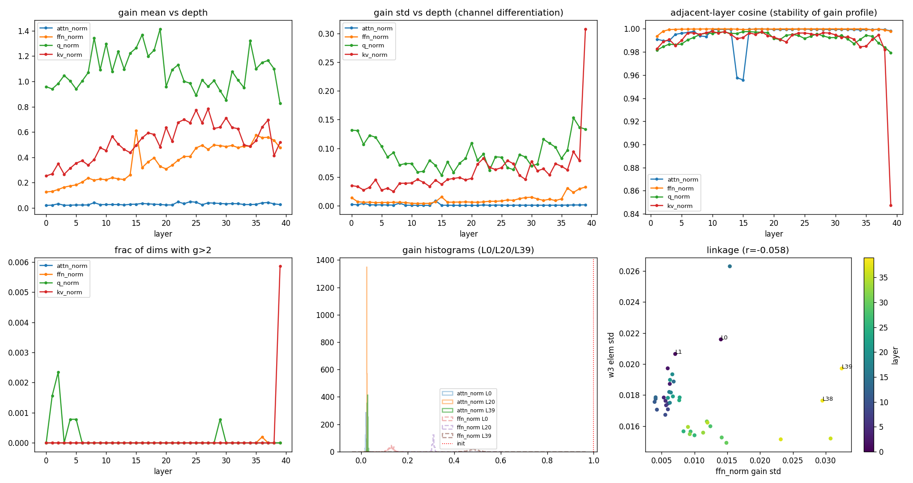

# RMSNorm 增益向量分析:尺度信息的真实载体

> 数据来源:`analysis/ds_v4_1_flash/analyze_norm_gains.py`(2026-09-19),原始产物
> `output/ds_v4_1_flash/weight_moments/norm_gains.{npz,json}`。
> 前序:[weight-moments.md](weight-moments.md)(权重矩分析);
> K3 同主题(含机制论证)见 [../kimi_k3/norm-gains.md](../kimi_k3/norm-gains.md)。

> **核心结论(与 K3 同向、更极端)**:
> RMSNorm 增益初始化时每个分量都为 1(参考推理代码 `RMSNorm` 为 ones 初始化);
> 训练完成后**子层入口增益普遍塌到 0.02–0.6**——attn_norm 只剩 0.02–0.05
> (恰好落在权重尺度 0.02 附近),最终 norm 也只有 0.271;
> 唯一留在 1 附近的是注意力内部的 q_norm(0.83–1.42)。
> **"norm 增益 ≈ 1"在本模型同样不成立。**

## 背景

增益 $g$ 是 RMSNorm 归一化后的逐维缩放向量,可折入相邻投影( $W\,\mathrm{diag}(g)$ ),
是 pre-norm 架构里尺度信息的主要载体。机制与 K3 相同:增益与后续投影存在重参数化
冗余,weight decay 把两者压向平衡范数(Rotational Equilibrium,Kosson et al.,
NeurIPS 2023)——本模型 attn_norm 的均值(0.020–0.049)几乎精确落在权重初始化尺度
0.02 上,是该机制迄今最干净的例证。

数值正确性:增益为 bf16 直接读取(`llm_lens` 自研解码),且本模型有独立的旁证——
嵌入/LM Head 长到 6–8 倍(见 weight-moments 结果 1)与入口增益塌到 1/40 并存,
说明尺度被整体"搬家",而非读取错误;视觉塔(同 checkpoint 独立 ViT)的 norm
同样塌到 0.05–0.43,排除单模块转换 bug。

## 结果

### 1. 四类主干增益的深度画像

| 增益类型 | mean 范围(浅层→深层) | 说明 |
| --- | --- | --- |
| `attn_norm`(注意力入口) | 0.020 → 0.049 | **塌到权重尺度**,衰减 20–50 倍 |
| `ffn_norm`(FFN 入口) | 0.126 → **0.613** | 衰减但**随深度回升**,最深 4 层 >0.47 |
| `attn.q_norm`(Q 低秩后) | 0.83–1.42 | **留在 1 附近**,最接近常规认知 |
| `attn.kv_norm`(KV latent 后) | 0.25–0.78 | 中度衰减 |
| 最终 `norm`(lm_head 前) | **0.271**(std 0.023) | 不在 1 附近( K3 为 0.796 ) |

衰减排序与 K3 一致("对 loss 越间接压得越狠"),但有两点不同:

- **ffn_norm 随深度单调上行**(0.126→0.613),而 K3 的对应增益浅深都在 0.01–0.38 低位。
  配合 Hyper-Connections(残差流是 4 份副本经 Sinkhorn 混合),深层 FFN 的"入口力度"
  被显著调大,尺度设计与单流残差架构不同;
- **q_norm 留在 1 附近**:q_norm 的输出直接进 wq_b 产生注意力 logit,对 loss 极直接;
  kv_norm(0.25–0.78)衰减多于 q_norm——K 侧打分还受 softmax 温度/attn_sink 缓冲。

负增益几乎不存在(四类主干增益 ≤0.2%,attn_norm/ffn_norm 为 0)——通道符号稳定,
与 K3 的 layernorm 一致(但 K3 的 AttnRes res_norm 有 30–45% 负值,本模型没有对应模块)。

### 2. 通道画像:跨层高度一致、两分支几乎重合

- **相邻层余弦**:attn_norm 0.999、ffn_norm 1.000、q_norm 0.994、kv_norm 0.995
  (最低也在 0.85)——通道重要性画像比 K3(0.95–1.0)还要稳定;
- **同层 attn_norm 与 ffn_norm 的余弦中位 0.999**:两个分支入口的通道画像**几乎相同**——
  训练学出的"哪些通道重要"是层级属性而非分支属性(很可能继承自上游残差流的
  通道尺度画像);
- **离群维存在但稀疏**:attn_norm 的 max/p95 中位仅 1.11(分布极紧),但个别层有
  突出维( L14 的 attn_norm max=0.328,为中位 12 倍);最极端的是 **L39 的 kv_norm
  有一维 g=5.97**(同层中位 0.50 的 12 倍,top10 均值 1.91)——末层 KV latent 的
  某个维度被显著放大,角色待查。

### 3. 其他模块的增益

| 模式 | 数量 | mean 范围 | 说明 |
| --- | --- | --- | --- |
| `compressor.norm` | 4(源层) | 0.39–0.82 | 压缩器入口,保留最多 |
| `indexer.k_norm` | 8(源层) | 0.42–0.65 | 检索 key 归一化 |
| `mtp.*.attn_norm/ffn_norm` | 3 | 0.047–0.24 | 与主干同型 |
| `mtp.0.main_norm` | 1 | 0.072 | DSpark 主干隐状态入口 |
| `mtp.2.norm` | 1 | 0.241 | 草稿头前,接近主干最终 norm |
| `vision.blocks.*.norm1/norm2` | 32 | 0.08–0.43 | 视觉塔同现象(判决性旁证) |
| `vision.norm` | 1 | 0.053 | ViT 出口,塌得最狠 |
| `engram.q/k_weight`(L1/L14) | 2 | 0.014–0.040 | 见下 |

### 4. Engram 门控权重:近乎均匀的门?

engram 的 `q_weight`/`k_weight`([4,5120],初始化全 1,仅以**乘积** $q \odot k$
参与门控打分)训练后双双塌到 mean≈0.014–0.040、37–44% 分量为负,且两者统计画像
几乎一致(但不逐值相等,最大差 1.27)——weight decay 把两个等价因子压到同一尺度,
正是 Rotational Equilibrium 的又一实例。

乘积 $q \odot k$ 的 $|g|$ 中位仅 ~2e-4(p99 ≈ 0.05–0.16):门控 logit 是
$\mathrm{signed\_sqrt}(\tilde d)$,其中 $\tilde d$ 为乘积加权后的归一化点积——
典型幅度被压到很小,$\mathrm{sigmoid}(\cdot) \approx 0.5$。
**即 Engram 的"匹配度门控"在绝大多数位置接近常数 0.5**,n-gram value 近似无条件写入
(写入强度取决于 value 本身)。这是否为训练收敛后的真实语义,需结合
`engram.wkv` 的 value 通路范数进一步验证。

### 5. 增益-权重联动(弱于 K3)

ffn_norm 增益指标 vs 共享专家元素 std 的逐层相关:
CV vs w1 的 r=0.52、mean vs w3/w2 的 r≈-0.30,其余组合 |r|<0.1。
方向与 K3 一致(增益分化大的层权重偏小、增益 mean 大的层 w2 偏小)但强度明显弱
(K3 的 post_gain_std vs up/down 达 -0.71/-0.74)。尺度在增益与权重间的"搬家"
在本模型没有 K3 那么干净,可能与 HC 架构下多了一层混合系数(hc_fn/scale)分担
尺度调节有关——hc_* 参数的逐层分析是下一步。

## 结论

1. 本模型 norm 增益**同样不能假设 ≈1**:入口增益塌到 0.02–0.6,attn_norm 精确落在
   权重尺度 0.02 附近;做有效权重分析必须把增益折入( $W\,\mathrm{diag}(g)$ );
2. 衰减程度仍按"对 loss 的直接性"排序,q_norm(注意力 logit 直通)是唯一留在 1 附近的;
   但最终 norm(0.271)没有像 K3(0.796)那样留在 1 附近——HC 架构下 logits 尺度的
   调节位置不同;
3. 通道画像跨层极稳(相邻余弦 ≈1),且 attn/ffn 两分支同层画像几乎重合(0.999);
4. Engram 门控权重塌缩 + 符号噪声化,乘积典型幅度 ~2e-4,门接近常数 0.5;
5. L39 kv_norm 的 g=5.97 极端维值得追查(对照 K3 的常驻通道 dim 3680 个案)。

## 待办

- [ ] hc_fn/hc_base/hc_scale 的逐层分布:HC 混合系数是否吸收了增益-权重之外的尺度调节
- [ ] 用有效尺度(增益折入)重算注意力 QK 谱,验证 logit 量级自洽(K3 的判决性检验)
- [ ] L39 kv_norm 极端维在 wkv/wq_b/残差流主方向中的角色
- [ ] Engram 有效写入强度:结合 engram.wkv 的 value 行范数 × 门 ≈0.5 估计对残差流的实际贡献
- [ ] 视觉塔 norm 增益的深度曲线(0.08→0.43 是否有结构)
