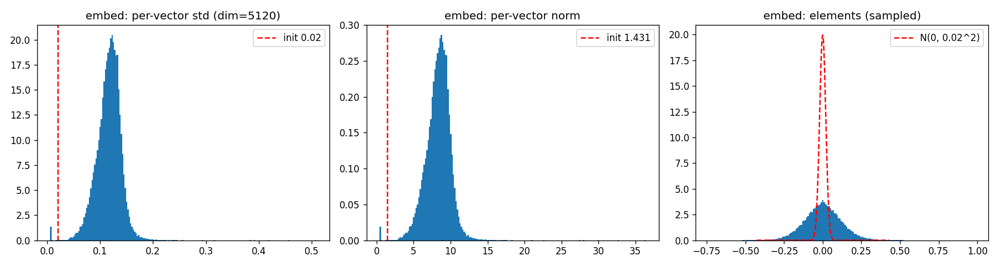
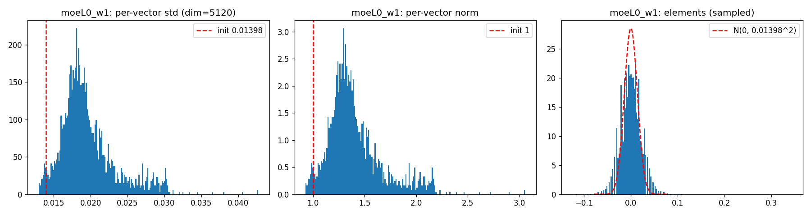
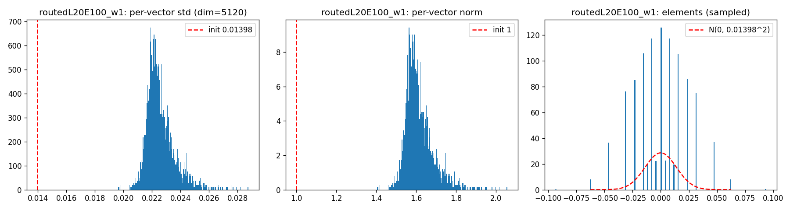
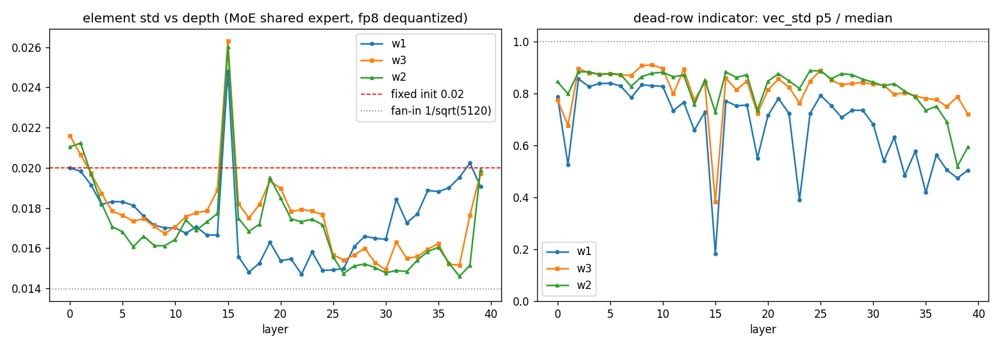
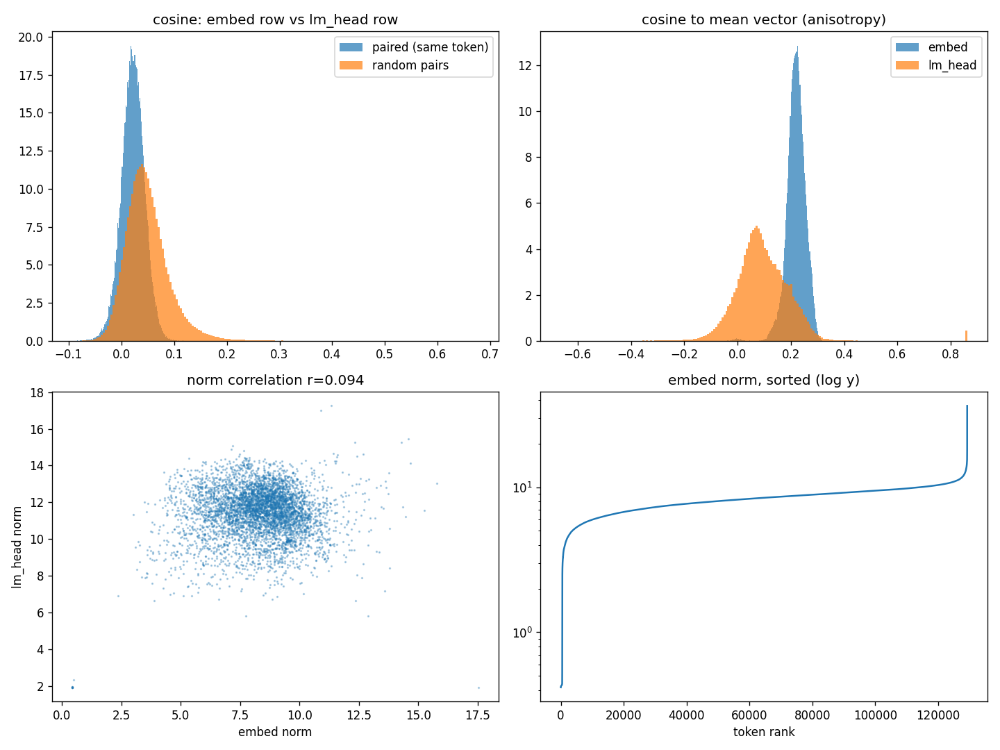

# 权重矩分析:初始化基线 vs 训练后实测

> 数据来源:`analysis/ds_v4_1_flash/` 的 `analyze_weight_moments.py`、`analyze_mlp_scale_depth.py`、
> `analyze_embed_lmhead.py`(2026-09-19 运行),原始产物在 `output/ds_v4_1_flash/weight_moments/`。
> 本文只记结论与解读;理论框架见 [../rmsnorm.md](../rmsnorm.md) §3–§4(方差链)。
> 前作(Kimi-K3 同主题)见 [../kimi_k3/weight-moments.md](../kimi_k3/weight-moments.md)。

## 背景:检验什么

初始化时权重的分量近似 iid 正态,方差链设计给出两组可检验的预测:

- **嵌入 / LM Head**:分量 std = `initializer_range`(本模型为 0.02),每个 token 向量
  范数集中在 $0.02\sqrt{5120} \approx 1.43$(相对涨落 $1/\sqrt{2D} \approx 1\%$);
- **FFN 矩阵**:若是扇入规则,w1/w3 分量 std = $1/\sqrt{5120} \approx 0.0140$、
  w2 为 $1/\sqrt{2304} \approx 0.0208$(两者应差 1.49 倍);若是 Megatron 式固定值,则都是 0.02。

与 Kimi-K3 的差异:本模型绝大多数矩阵是量化存储——共享专家 FP8(E4M3 + 32×32 UE8M0 块缩放)、
路由专家 FP4(E2M1 + 1×32 UE8M0 行块缩放)。所有统计在**反量化后**的 float32 上做
(反量化实现已与 torch/官方 convert.py 对拍逐值一致);量化噪声对元素 std 的污染
远小于下面观测到的训练改写幅度。

## 结果 1:嵌入与 LM Head 双双大幅长大(与 K3 相反)

| 矩阵 | 元素 std | vs 基线 0.02 | 逐行范数中位 | vs 基线 1.43 |
| --- | --- | --- | --- | --- |
| `embed` | 0.118 | **5.9x** | 8.45 | **5.9x** |
| `head` | 0.160 | **8.0x** | 11.54 | **8.1x** |

K3 是"嵌入缩小、LM Head 温和长大"(0.85x / 1.35x),本模型是两个表一起长到初始化的
6–8 倍,且逐行 std 展宽(0.077–0.148),初始化痕迹已被彻底改写。
配合 [norm-gains.md](norm-gains.md) 的发现(第一层 attn_norm 增益塌到 ~0.02、
最终 norm 只有 0.27)看:残差流入口处的巨大尺度会被下游 norm 增益压回去,
"尺度"在这套架构(Hyper-Connections + 低增益 norm)里的存储位置与 K3 明显不同。

## 结果 2:FFN 初始化仍是固定 std≈0.02(Megatron 式)

40 层共享专家的 w1/w3/w2 元素 std 落在 0.0147–0.0263:

- 相对固定值 0.02:比值 0.73–1.32(合理的训练改写);
- 扇入判据:若是扇入初始化,w1/w3 应比 w2 小 1.49 倍,实测三者基本同量级——排除扇入规则。

路由专家(3 层 × 4 个抽样,FP4 反量化)元素 std 中位 0.023(w1/w3/w2 同),
约为固定基线的 1.15–1.2 倍,略大于共享专家;逐行 std 极紧(p5/中位 ≈ 0.93–0.96),
**没有任何死行迹象**——384 个专家的初始化与训练改写都非常均匀。

## 结果 3:深度演化——L15 死行层与"w1 渐长"趋势

- **L15 显著异常**:元素 std 全模型最高(2.48e-2),同时 key 行 std 的 p5/中位数只有
  **0.183**(≥5% 的行近零)——死行与整体放大并存,值得单独解剖;
- **轻度塌缩层**:L1(0.53)、L19(0.55)、L23(0.39)、L35(0.42)的 p5/中位明显偏低,
  其余层健康(0.68–0.86);
- **趋势**:w1(gate)的元素 std 随深度整体上行(1.5e-2 → 2.0e-2),w2 在中段( L25–L37 )
  压低到 1.45e-2–1.53e-2,但**末层 L39 反弹**到 1.99e-2——与 K3 的"末段塌缩"形态不同,
  本模型最后一层 FFN 写回通路没有关小;
- 注意 L15 也是 compress_ratio=2 区段( L2–L19 )的中部、indexer 源层 L14 之后,
  异常是否与稀疏检索的负载分布有关,待查。

## 结果 4:嵌入与 LM Head 弱耦合

- **配对余弦小但显著为正**:同 token 两向量余弦均值 0.022、中位 0.022、p95 0.057,
  约为随机基线 std(0.014)的 1.6 倍——不像 K3 那样完全归零,保留了微弱耦合;
- **范数联动更弱**:corr(e_norm, h_norm) = 0.09(K3 为 0.30);
- **各向异性方向反转**:K3 是 lm_head 更各向异性,本模型是 **embed 更各向异性**
  (均值向量范数 = 中位 token 范数的 21.5%,cos_to_mean 中位 0.22;lm_head 侧为 0.087);
- **极端 token 形态与 K3 相反**:范数最大的全是**稀有词**(小语种字符串、`asarangang`、
  `Roskov` 等,范数 17–36),范数最小的全是高 id 的 added/特殊 token(128865+,范数 ~0.42,
  约为主体 1/20)——稀有 token 嵌入"长得大",疑似用范数补偿低更新频次,待验证;
- 配对余弦最负的是高频 token(`1`、`("`、`10` 等,-0.076~-0.084),
  最正的是稀有 multilingual token(~0.11–0.13)。

## 结论

1. 初始化的"白噪声球面"同样被训练改写,但方向相反:嵌入/LM Head 长到 6–8 倍
   (K3 是缩小/微涨),FFN 保持在固定 0.02 基线的 ±35% 内;
2. FFN(共享 + 路由专家)初始化统一为固定 std=0.02,不做扇入缩放——与 K3 结论一致;
3. 路由专家(FP4)权重分布健康且极均匀,量化没有掩盖任何死神经元问题;共享专家有
   明确的深度结构与一个死行异常层( L15 );
4. 嵌入与 LM Head:方向弱耦合(余弦 ~0.02)、尺度几乎解耦( r=0.09 ),
   各向异性集中在 embed 侧(与 K3 相反)。

## 待办

- [ ] 解剖 L15 死行:key 行近零的神经元的 w2 value 列是否也近零(全死 vs 半死)
- [ ] 稀有 token 大范数的机制:与词频(用词表 rank 近似)的定量关系
- [ ] 注意力投影(wq_a/wq_b/wkv/wo)的矩与谱分析(FP8 反量化已就绪)
- [ ] 路由器 gate.weight 行向量夹角分布(专家正交分化?)与 bias/bias_vl 对比
- [ ] engram 哈希表抽样矩分析(3.84 亿行,需按行采样读取)
- [ ] mtp 三层与主干对应层的尺度对比
