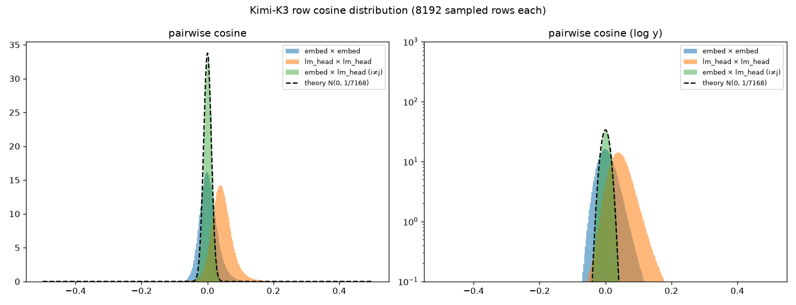

# 词嵌入 / LM Head 的两两余弦分布:高维近正交假设的实测

> 脚本:`analysis/kimi_k3/analyze_cosine_dist.py`;数据:`output/kimi_k3/weight_moments/cosine_dist.{json,npz}`。
> 互补分析(同 token 的嵌入行 vs LM Head 行)见 `analyze_embed_lmhead.py`。

## 问题

"高维随机向量近乎垂直"常被引为注意力加权求和、残差累加不丢失信息的直觉基础。
理论:$d$ 维球面上两个均匀随机单位向量的余弦近似 $N(0, 1/d)$(精确密度正比于
$(1-c^2)^{(d-3)/2}$)。K3 的 $d=7168$,理论 std $\approx 0.0118$。
本文实测:训练后的 token 向量还在多大程度上符合这条理论曲线。

## 方法

全表 163840 行的 Gram 需 $2V^2d \approx 3.9\times10^{17}$ FLOP 与 107 GB 内存,不可行;
改为每表固定种子随机抽 8192 行(约 3355 万对),顺序扫盘两遍(共 4.4 GiB)+ 两次
约 1 TFLOP 的 GEMM,总耗时约 1 分钟。三种配对:表内 embed×embed、lm_head×lm_head,
以及跨表异 token 的 embed×lm_head($i \ne j$,排除同 token 配对信号)。

## 结果

| 配对 | mean | std | std / 理论 | $\lvert\cos\rvert>0.1$ 占比 | 极值 |
| --- | --- | --- | --- | --- | --- |
| embed × embed | +0.004 | 0.0281 | 2.38x | 0.55% | [-0.13, 0.78] |
| lm_head × lm_head | +0.045 | 0.0341 | 2.89x | 5.07% | [-0.43, 1.00] |
| embed × lm_head(异 token) | +0.002 | 0.0119 | **1.01x** | 0.00% | [-0.06, 0.07] |

## 解读

1. **跨表配对几乎完美符合随机理论**(std 1.01x):embed 与 lm_head 各自训练、不共享,
   异 token 之间没有任何残余相关性——理论曲线在"无结构"极限下是准确的。
2. **表内分布明显比理论宽(2.4~2.9x)且整体正偏**:token 向量存在共同的均值方向
   (各向异性,lm_head 尤其显著,mean 余弦 +0.045),叠加更宽的分散。这正是
   `analyze_embed_lmhead.py` 中"均值向量范数显著"的另一面。含义:把 token 向量当
   独立随机向量会**低估**加和时的相互干扰约 2~3 倍。
3. **lm_head 的右尾很重**:5% 的配对 $|\cos|>0.1$,且发现 16 对 $\cos>0.9$——全部是
   无法 UTF-8 解码的 byte token(id 179、63057、128681、146404、146407 等),范数
   整齐地停在约 0.711(全表最低档)。这些是从未在语料中出现、训练后仍几乎相同的
   "死 token"行;lm_head 对它们没有学习压力,保留了出厂状态。词表虚高
   (163840)里有相当一部分是这类占位行。
4. **对"加和后信息保留"的修正版结论**:7168 维下无关向量的典型干扰仍是小量
   ( $|\cos| \sim 0.03$ ),$k$ 个向量相加的串扰约 $0.03\sqrt{k}$,$k \lesssim 100$
   时仍远低于自项信号 1——近正交直觉成立;但真实模型向量不是随机的,各向异性
   与重尾使有效容量低于理论估计,且"靠点积检索加和中的成分"对 lm_head 侧向量
   会更不可靠一些。
