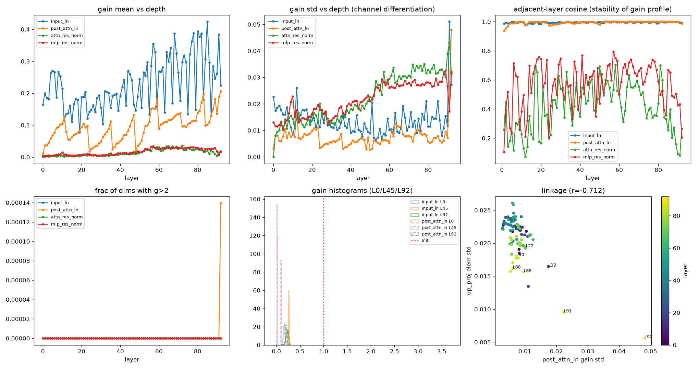

# RMSNorm 增益向量分析:尺度信息的真实载体

> 数据来源:`analysis/kimi_k3/analyze_norm_gains.py`(2026-09-18),原始产物
> `output/kimi_k3/weight_moments/norm_gains.{npz,json}`。
> 前序:[weight-moments.md](weight-moments.md)(权重矩分析)。

> **核心结论(反直觉,已多重验证为真)**:
> RMSNorm 增益初始化时**每个分量都精确等于 1**(`KimiRMSNorm` 用 `torch.ones`,
> 见建模代码);训练完成后却**普遍显著变小**——input/post_attention layernorm
> 只剩 0.01–0.38,AttnRes 的 res_norm 塌到 ~0.001,衰减 3–1000 倍;
> 唯一留在 1 附近的是 lm_head 前的最终 norm(0.796)。
> 即:**"norm 增益 ≈ 1"在本模型中不成立,它是训练改写幅度最大的一类参数**。
> 正确性证据与机制(weight decay 把增益压向平衡范数)见下。

## 背景与一个重要澄清

增益 $g$ 是 RMSNorm 归一化后的逐维缩放向量,可折入相邻投影($W\,\mathrm{diag}(g)$),
是 pre-norm 架构里**尺度信息的主要载体**(分支对上游整体尺度不变,"每层用多大力气"
很大程度沉淀在增益里)。

**数值正确性经三方验证**:llm_lens 自研 bf16 解码、手工字节解析
(如 `0x3e82` → 0.2539)、torch+safetensors 官方库读取,三者逐值一致——
权重文件里存的就是这些值,不是读取 bug。

**"统一缩放/转换 bug"假设也被排除**:若是统一除常数,所有增益应同比例,
但实测跨层差 6 倍(0.09–0.56)、跨类型差 800 倍(res_norm 0.001 vs 最终 norm 0.796),
且带有功能结构(锯齿周期≈12 层对齐 AttnRes block、与 FFN 权重 r=-0.73 反相关、
衰减程度按"对 loss 直接性"排序)。判决性证据:**视觉塔**(同 checkpoint 的独立
标准 pre-norm ViT,无 AttnRes)的 27 层 norm0/norm1 增益中位数同样只有 ~0.3——
衰减是全 checkpoint 一致的训练层面现象,不是某个模块的转换错误。

**功能级判决证据(QK 谱)**:本仓库的 QK 谱分析(`extract_qk_spectrum.py`)
把 `q_a_layernorm`/`kv_a_layernorm` 的增益折入有效权重 $M=W_Q^\top W_K$,
实测 $\sigma_1(M)$ ≈ 8–35,对应注意力 logit 尺度 $\sigma_1/\sqrt{192}$ ≈ **0.6–2.5**——
正常工作的注意力应有的量级。若增益"应该 ≈1"而实际被缩了 ~4 倍,
logit 尺度会大 16 倍(≈10–40),softmax 恒 one-hot,模型不可能正常工作。
功能自洽 → 存档的增益就是实际生效的增益。

机制:增益 $g$ 与后续投影 $W$ 存在重参数化冗余($g$ 乘 $c$、 $W$ 除 $1/c$ 功能不变),
weight decay 在等价解族中偏好 $\|g\|$ 与 $\|W\|$ 平衡,把增益压向权重量级——
即 Rotational Equilibrium(Kosson et al., NeurIPS 2023, arXiv:2305.17212):
归一化使参数尺度(近似)不变时,weight decay 把范数驱动到平衡点。
最终 norm 例外(直接缩放 logits,尺度不变近似不成立);
res_norm 塌得最狠(输出只过 softmax,最接近尺度不变)。
附带推论:该模型训练时 norm 增益大概率**没有**被排除在 weight decay 之外。

**先排除一个假设**:实测增益均值远小于 1 且出现负值,一度怀疑是 Gemma 式
零初始化 + $(1+w)$ 参数化。查建模代码 `modeling_kimi_linear.py` 的
`KimiRMSNorm`:`torch.ones` 初始化、直接相乘——标准实现。
**所以以下所有偏离都是训练的真实改写。**

## 结果

### 1. 增益整体大幅衰减(gain decay)——但衰减程度与"对 loss 的直接性"负相关

| 增益类型 | mean 范围(浅层→深层) | 说明 |
| --- | --- | --- |
| **最终 `norm`**(lm_head 之前) | **0.796**(std 0.164) | **最接近 1**,行为接近常规认知 |
| `input_layernorm` | 0.13 → 0.38 | 衰减到初始值的 1/5~1/3 |
| `post_attention_layernorm` | 0.01 → 0.21 | 衰减最狠,L0 只剩 1% |
| `self_attention/mlp_res_norm` | ~0.001–0.03 | 几乎塌到 0(见结果 4) |

机制解读:增益对 loss 的影响越间接,weight decay 越容易把它压下去——
分支输出尺度经残差/AttnRes 缓冲后对 loss 影响弱,增益被压;
最终 norm 直接缩放 logits($\mathrm{lm\_head} \cdot (g \odot \hat{h})$),
对 loss 影响最直接,于是留在 1 附近。"该用多大力气"由增益与线性层权重
**联合**决定,衰减的尺度被权重侧补偿(见结果 5)。
负增益在两类 layernorm 里几乎不存在(≤0.3%),通道符号是稳定的。

**"会不会是大部分维度压成 0、少数维度还大"的检验(绝对值 + top-k 口径)**:
不成立。两类 layernorm 的 mean ≈ $|g|$ 中位 ≈ $|g|$ p95(分布紧),
连 top10 $|g|$ 也只有 0.2–0.4——是**近乎均匀的整体衰减**,不是稀疏压制;
res_norm 的 mean 虽有正负抵消成分(30–45% 为负),但 top10 $|g|$ 同样只有 ~0.1,
不存在"一批维度仍保持在 1 附近"。这说明 weight decay 对各维一视同仁地下压,
通道间的相对分化(std/CV)才是训练信号留下的部分——
也解释了相邻层画像余弦 ≈1:衰减是各向同性背景,分化是叠加其上的结构。

### 2. 增益画像:形状稳定、整体漂移、带 AttnRes 周期的锯齿

- **相邻层余弦**:两类 layernorm 的逐层余弦 ≈ 0.95–1.0——**通道重要性画像高度稳定**,
  各层在"选哪些通道"上高度一致,变化的主要是整体幅度;
- **锯齿结构**:`input_layernorm` / `post_attention_layernorm` 的 mean 随深度上升,
  但以约 12 层为周期回落——与 `attn_res_block_size=12` 的 block 边界对齐。
  block 内逐层放大、跨 block 由 AttnRes 融合重置,增益曲线把 AttnRes 的
  分块结构直接"可视化"了;
- **极端通道**:个别层存在离群放大维(L92 的 post_attention 有一维 $g=3.7$,
  L12 有一维 1.08),是少数被赋予特殊地位的通道。

### 3. "刻意突出的 k 个维度"存在,但形态是少量保活通道

top-k 离群分析(逐层排序 $|g|$,看 top 维与主体 p99 的落差):

- **主体不是两极分化**:多数层分布很紧(input_ln 的 max/p99 中位仅 1.6 倍、
  约半数层 0 个离群维)——均匀衰减是主调;
- **但每层确有 1–4 个"保活通道"**:post_ln 典型 max/p99 ≈ 5 倍,
  极端如 L92 两维( $g=3.7$ / 1.3,中位数的 18 倍);input_ln 的中深层
  (L51–L79)也有 1–4 维达 p99 的 6–9 倍。这些维的 $|g|$ ≈ 0.5–1.5,
  **接近初始值 1——不是被放大,而是"抵抗住了 decay"**,主体掉到 0.1 它们没掉;
- **跨层持续性弱、有个例**:93 层没有共同 top10 维度,相邻层 top10 重合
  中位 1–3/10(画像随层漂移);但 post_ln 的**维度 3680** 出现在 76/93 层的
  top10 中,为同层中位数的 4.3–12.4 倍——一个近乎全局常驻的突出通道,
  其角色值得后续追查(与残差流/LP 主方向的关系)。

### 4. AttnRes 的 res_norm 增益塌缩 → 融合接近均匀

两个 `res_norm` 的增益均值 ~0.001–0.03、std 0.01–0.04、**30–45% 的维为负**,
相邻层余弦在 0.2–0.8 间乱跳(噪声状)。有效读出是 $w \odot g$
(`res_proj` std≈0.057 × 增益 std≈0.02),block 间 logit 差异量级 ~0.1——
**AttnRes 的 softmax 融合权重接近均匀**,只比等权凸组合多出 ±10% 量级的偏好。
这直接回答了 `kimi-k3.md` 分析切入点 #6 的问题(截至当前权重状态)。

### 5. 增益-权重此消彼长(尺度补偿)

`post_attention_layernorm` 增益 std 与 FFN up/down 权重元素 std 的逐层相关
**r ≈ -0.71 / -0.74**(mean 与 gate 无相关,r≈0.03):增益分化越厉害的层,
FFN 写回通路的权重越小。末段塌缩层 L91/L92 是散点图上的极端点
(增益 std 全模型最高、up/down 权重全模型最小)——
**尺度信息确实在增益与权重之间迁移,二者是同一个"分支力度"的两种存储方式**。

## 结论

1. K3 的 norm 增益**不能一概而论**:"分支入口增益 ≈ 1"的直觉不成立
   (衰减 3–100 倍,且与 FFN 权重尺度互补),但最终 norm ≈ 0.8 留在 1 附近——
   衰减程度由该增益对 loss 的直接性决定。分析有效权重时必须把增益折入
   ($W\,\mathrm{diag}(g)$);
2. layernorm 增益的**通道画像跨层稳定**(相邻余弦≈1),深层变化是幅度而非方向;
   均值锯齿周期 ≈12 层,与 AttnRes block 边界对齐;
3. 离群维分析:主体均匀衰减,但每层有 1–4 个 $|g|$≈0.5–1.5 的"保活通道"
   (抗住 decay 留在初始量级);post_ln 维度 3680 在 76/93 层持续突出
   (4.3–12.4 倍于同层中位);
4. AttnRes 融合接近均匀:res_norm 增益塌缩 + 符号噪声化,logit 差异仅 ~0.1;
5. 后续做谱/矩分析(如 QK 谱、FFN 有效 key/value 行)时,基线应按
   "增益 × 权重"的联合尺度重算,裸权重统计会系统性低估深层分支的实际贡献。

## 待办

- [ ] 用有效尺度($g$ 折入 $W$)重算 FFN 矩分析的基线,复核"末段塌缩"结论是否反转
- [ ] 直接计算 AttnRes 的 block logits 分布(需选代表性输入,或用随机向量 + 实测增益模拟)
- [ ] L92 post_attention 的 $g=3.7$ 极端通道与常驻通道 dim 3680:
  对应维度在 lm_head / 嵌入 / 残差流主方向中的角色
- [x] ~~相邻层余弦≈1 的通道画像本身:top 通道在各层间是否同一批~~
  (已答:无全局共同 top 维,相邻重合 1–3/10,仅 dim 3680 跨 76 层)
