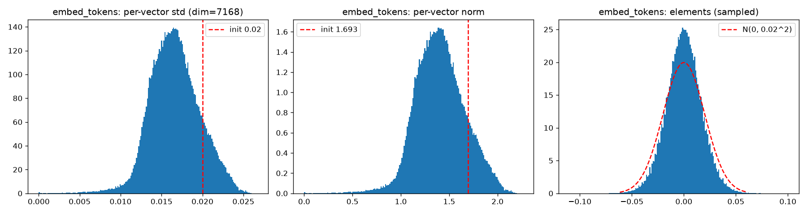
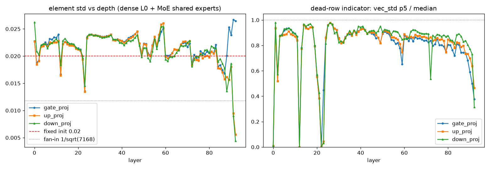
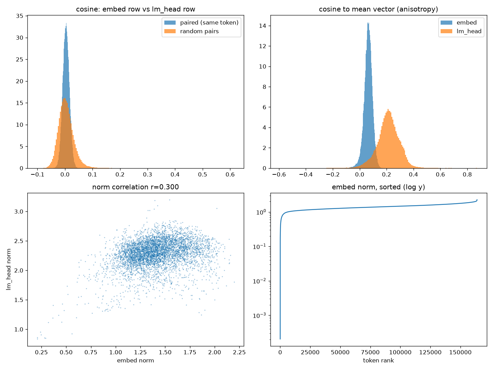

# 权重矩分析:初始化基线 vs 训练后实测

> 数据来源:`analysis/kimi_k3/` 的 `analyze_weight_moments.py`、`analyze_mlp_scale_depth.py`、
> `analyze_embed_lmhead.py`(2026-09-18 运行),原始产物在 `output/kimi_k3/weight_moments/`。
> 本文只记结论与解读;理论框架见 [../rmsnorm.md](../rmsnorm.md) §3–§4(方差链)。

## 背景:检验什么

初始化时权重的分量近似 iid 正态,方差链设计给出两组可检验的预测:

- **嵌入 / LM Head**:分量 std = `initializer_range`(K3 config 为 0.02),每个 token 向量
  范数集中在 $0.02\sqrt{7168} \approx 1.69$(相对涨落 $1/\sqrt{2D} \approx 0.8\%$);
- **FFN 矩阵**:若是扇入规则,分量 std = $1/\sqrt{D_{in}}$($D_{in}=7168$ 时约 0.0118);
  若是 Megatron 式固定值,则也是 0.02。

统计视角:嵌入/LM Head 的每行是一个 token 向量(分量视为 $D$ 次采样);
FFN 看作 key-value 表——gate/up_proj 的每行是 key(特征检测器),
down_proj 的每列是 value(写回残差流的方向)。

## 结果 1:嵌入缩小、LM Head 长大

| 矩阵 | 元素 std | vs 基线 0.02 | 逐行范数中位 | vs 基线 1.69 |
| --- | --- | --- | --- | --- |
| `embed_tokens` | 0.0169 | 0.845 | 1.40 | 0.83 |
| `lm_head` | 0.0271 | 1.353 | 2.31 | 1.36 |

初始化痕迹基本被改写:逐行 std 从 0.012 到 0.022 大幅展宽(初始化预测应集中在
$\pm 0.8\%$ 内),token 间尺度显著分化。两表**不共享**权重($\mathtt{tie\_word\_embeddings=false}$),
训练把它们的尺度朝相反方向推。

## 结果 2:FFN 初始化是固定 std≈0.02(Megatron 式)

93 层的 gate/up/down 元素 std 绝大多数落在 0.019–0.026:

- 相对固定值 0.02:漂移仅 $\pm 25\%$(合理的训练改写);
- 相对扇入基线 $1/\sqrt{7168}=0.0118$:整齐地约 2 倍(不可能所有矩阵同比例涨)。

结论:K3 的 MLP 初始化用固定 0.02,不随扇入缩放——印证了
[../rmsnorm.md](../rmsnorm.md) §4.3"工程现实"那条(Megatron 粗放初始化 + 三重兜底)。

## 结果 3:深度演化——末段塌缩与死行层

- **末段塌缩(趋势,非孤例)**:L88–L92 的共享专家 gate 涨到全模型最高(2.5–2.7e-2)
  而 up/down 断崖缩小,L92 只剩 5.6e-3 / 4.4e-3(初始化的 ~1/4)。
  解读:靠近输出端的 FFN,门控保持张力但写回残差流的通路被训练主动关小。
- **死行集中在特定层**:key 行 std 的 p5/中位数在 L12、L22 砸到 ~0.001
  (≥5% 的行近零),dense L0 为 0.01,L2/L20/L21 中度塌缩(0.38–0.56);
  其余 80 多层健康(0.75–0.97)。L12/L22 的元素 std 也同步偏低,值得单独解剖。

## 结果 4:嵌入与 LM Head 已"形同陌路"

- **配对余弦 ≈ 0**:同一 token 的两个向量余弦均值 0.004、p95 仅 0.024,
  与随机基线噪声不可分——untied 训练后"输入表示"与"输出打分方向"完全解耦;
- **范数仍有耦合**:corr(e_norm, h_norm) = 0.30,"哪些 token 该大"部分同步(频率驱动);
- **各向异性**:随机两向量余弦 std 实测 0.028,是各向同性理论值 $1/\sqrt{7168}=0.0118$
  的 2.4 倍,嵌入空间有明显共享结构;且 **LM Head 比嵌入更各向异性**
  (cos-to-mean 中心 ~0.2 vs 0.064)——lm_head 行共享一个公共方向,对应词频先验 logit;
- **极端 token**:范数垫底的全是死 token(`\ufffd` 替换符、乱码片段,范数 ~2e-4,
  几乎没被训练);范数最大的全是结构字符(`\`、`{`、`}`、数字)——代码/标记文本高频 token。

## 结论

1. 初始化的"白噪声球面"已被训练彻底改写,但改写幅度整体温和(固定 0.02 基线的 $\pm 50\%$ 内);
2. K3 全模型(嵌入 + FFN)初始化统一为固定 std=0.02,不做扇入缩放;
3. 训练对 FFN 的改写有明确深度结构:末段 5 层输出通路塌缩,L12/L22 出现成批死神经元;
4. 嵌入与 LM Head 方向上解耦(余弦≈0)、尺度上弱耦合(r=0.3),lm_head 有强公共方向。

## 待办

- [ ] 解剖 L12/L22 死神经元:key 行近零的神经元的 value 列(down_proj)是否也近零(全死 vs 半死)
- [ ] lm_head 公共方向与 token 频率的定量关系(需词频数据,或用词表 rank 近似)
- [ ] 末段塌缩层(L88–L92)与 AttnRes 末段 block 的关系:FFN 贡献是否被 AttnRes 凸组合替代
- [ ] 路由专家(mxfp4)反量化后做同样的矩分析,对比共享专家
